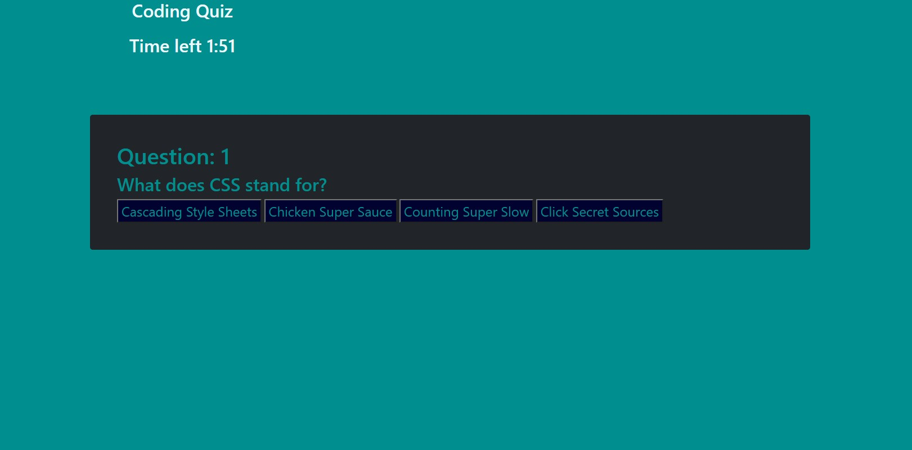

The Coding Quiz page is a light blueish green background website with a start button and an empty box that displays Question.
After clicking on the start button, the question is filled with inner text information that displays the first question and brings up 4 multiple choice options for Answers.

The time starts counting down from 2 minutes and is displayed the entire time through the quiz.
When the correct answer is clicked, it highlights green.
When in incorrect answer is clicked, it is turned red to display that you have already chosen that answer and not to click it again, 15 seconds are deducted from your time left when a wrong answer is clicked.

The question is stored in innerttext document editing, and the answer is applied to one of the four answer boxes.

### Review

As you proceed in your journey to becoming a full-stack web developer, it’s likely that you’ll be asked to complete a coding assessment, perhaps as part of an interview process. A typical coding assessment is a combination of multiple-choice questions and interactive coding challenges.

To help you become familiar with these tests and give you a chance to apply the skills from this module, this module’s Challenge invites you to build a timed coding quiz with multiple-choice questions. This app will run in the browser, and will feature dynamically updated HTML and CSS powered by JavaScript code that you write. It will have a clean, polished, and responsive user interface. This module’s coursework will teach you all the skills you need to succeed in this assignment.

You are required to submit BOTH of the following for review:

The URL of the functional, deployed application.

The URL of the GitHub repository. Give the repository a unique name and include a README describing the project.